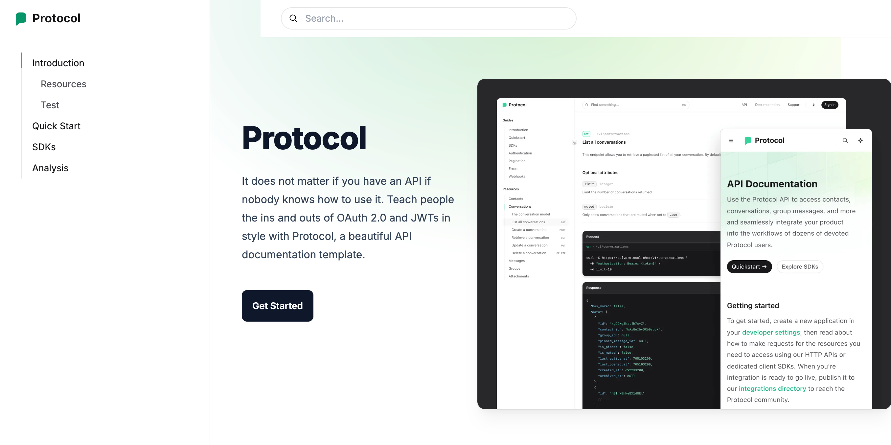

# DocuCraft

DocuCraft is a modern documentation website template designed to help developers and organizations create and maintain comprehensive documentation for their projects. Built with Next.js and styled using Tailwind CSS, DocuCraft offers a clean, responsive, and easily customizable platform for presenting project information effectively.

## Features

- **Easy Navigation**: Intuitive structure with a sidebar and top navigation for seamless browsing.
- **Markdown Support**: Write documentation content in Markdown for simplicity and flexibility.
- **Dynamic Routing**: Supports dynamic URL-based routing for better scalability and flexibility.
- **Loading and Streaming**: Efficient data fetching with loading and streaming capabilities for a smooth user experience.
- **Error Handling**: Built-in error handling to provide a robust and user-friendly interface.
- **Search Functionality**: Allows users to quickly find relevant documentation pages and content.

## Live Site

Check out the live version of the application here: [DocuCraft Live](https://docucraft-eta.vercel.app/)

## Preview



## Technologies Used

- **Next.js**: A React-based framework for server-side rendering and generating static websites.
- **Tailwind CSS**: A utility-first CSS framework for rapid UI development.
- **MDX**: Combines Markdown and JSX, allowing for rich content creation.

## Getting Started

To set up the DocuCraft project locally, follow these steps:

1. **Clone the Repository**:
   ```bash
   git clone https://github.com/FARDIN98/docucraft.git
   cd docucraft
   ```

2. **Install Dependencies**:
   Ensure you have [Node.js](https://nodejs.org/) installed. Then, run:
   ```bash
   npm install
   ```

3. **Run the Development Server**:
   ```bash
   npm run dev
   ```
   The application will start in development mode, typically accessible at `http://localhost:3000`.

4. **Build for Production**:
   To create an optimized production build:
   ```bash
   npm run build
   npm start
   ```

## Acknowledgements

- [Next.js](https://nextjs.org/) for the robust React framework.
- [Tailwind CSS](https://tailwindcss.com/) for the utility-first CSS framework.
- [MDX](https://mdxjs.com/) for combining Markdown and JSX.

---

